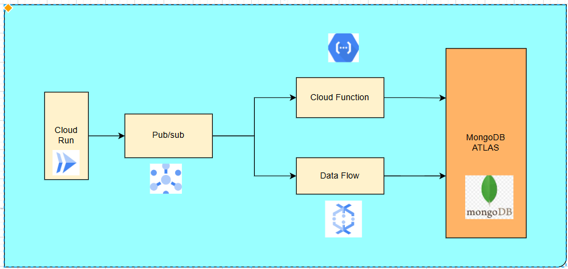
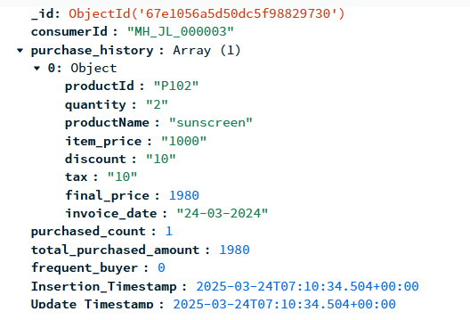

# Django API Project

## Overview
This project is a Django-based API that accepts purchase payloads, processes them, and sends refined data to Google Cloud Pub/Sub. The processed data is then stored in MongoDB Atlas through two separate methods:

1. **Cloud Function** - Sends data to MongoDB Atlas (Collection A).
2. **Cloud Dataflow** - Sends data to MongoDB Atlas (Collection B).

The API is deployed on Google Cloud Run for scalability and efficiency.

---

## Features
- Accepts purchase payloads via REST API.
- Refines and processes incoming data.
- Publishes data to Google Cloud Pub/Sub.
- Two processing pipelines:
  - **Cloud Function** for sending data to MongoDB Atlas (Collection A).
  - **Cloud Dataflow** for sending data to MongoDB Atlas (Collection B).
- Hosted on Google Cloud Run and Automated using github. uses Dockerfile for deployment
- Implements structured logging for debugging.

---

## Architecture Diagram


---

## File Structure
```
Django_API/
│── django_api/
│   │── __init__.py
│   │── asgi.py
│   │── settings.py
│   │── urls.py
│   │── wsgi.py
│
│── apps/
│   │── myapp/
│   │   │── __init__.py
│   │   │── models.py
│   │   │── views.py
│   │   │── serializers.py
│   │   │── urls.py
│   │   │── admin.py
│   │   │── tests.py
│   │   │── migrations/
│
│── cloud_function_sendMongoDB/
│   │   │── main.py
│   │   │── send_mongodb.py
│   │   │── requirements.txt
│   │── cloud_dataflow_sendMongoDB/
│   │   │── main.py
│
│── lib/
│   │── __init__.py
│   │── mapping.py
│
│
│── db.sqlite3
│── manage.py
│── Dockerfile
│── Readme.md
│── requirements.txt
│── venv/

```

---

## Installation & Setup
### Prerequisites
- Python 3.8+
- Google Cloud SDK
- Docker
- MongoDB Atlas (setup connection string)

### Steps
1. **Clone the repository:**
   ```sh
   git clone https://github.com/Rohit-Sandanshiv/django_cloudRun_Project.git
   cd django_cloudRun_Project.git
   ```
---

## API Endpoints
### 1. Insert Purchase Data
**Endpoint:** ` -X POST https://django-cloudrun-project-157688930781.us-central1.run.app/purchases/`

**url for cmd:** `curl -X POST https://django-cloudrun-project-157688930781.us-central1.run.app/purchases/ -H "Content-Type: application/json" -d " { \"consumerId\": \"MH_JL_000003\", \"productId\": \"P102\", \"quantity\": \"2\", \"productName\": \"sunscreen\", \"item_price\": \"1000\", \"discount\": \"10\", \"tax\": \"10\", \"invoice_date\":\"24-03-2024\" }"`

**Payload:**
```json
{ 
   "consumerId": "MH_JL_000003", 
   "productId": "P102", 
   "quantity": "2", 
   "productName": "sunscreen", 
   "item_price": "1000", 
   "discount": "10", 
   "tax": "10", 
   "invoice_date":"24-03-2024"
}
```

**Response:**
```json
{
  "message": "Published to Pubsub",
  "status": "success"
}
```

---

## Cloud Integration
### 1. **Google Cloud Pub/Sub**
- The API publishes refined purchase data to a Pub/Sub topic.
- pub/sub name : data_ingestion

### 2. **Google Cloud Function**
- Triggers on new Pub/Sub messages.
- Stores data in MongoDB Atlas (Collection A).

### 3. **Google Cloud Dataflow**
- Reads messages from Pub/Sub.
- Processes data using Apache Beam.
- Stores data in MongoDB Atlas (Collection B).

---

## Deployment
### Deploy API to Cloud Run
1. **Pipeline: Configured a CI/CD pipeline with GitHub Actions**
2. **Containerization: Used Docker for building and deploying**
3. **Deployment Target: Google Cloud Run**

### Deploy Cloud Function
 **Deployed using inline editor**

### Deploy Dataflow Pipeline
```sh
python main.py \    
--runner DataflowRunner \    
--project project-gcp-pipeline \   
--temp_location gs://sample-bucket-data2/tmp/ \  
--region us-central1 \
--streaming \ 
--requirements_file requirements.txt
```

---
### MongoDb Server
1. **Create a Cluster**
2. **Create two databases a) mongoDB_Dataflow   b) mongoDB_functions**
3. **Create collection named purchase inside both databases**
4. **inside setting/network_access/ allow requests from all ipv4 and add this "0.0.0.0/0 (includes your current IP address)"**
5. **Data received at server :**


---

## Future Enhancements
1. **Security Enhancements:**
   - Implement JWT-based authentication.
   - Use encrypted connections for MongoDB.
2. **Database Optimization:**
   - Move to a scalable NoSQL database.
   - Implement caching for frequent queries.
3. **Monitoring & Logging:**
   - Integrate Stackdriver for logs and monitoring.
   - Use Prometheus & Grafana for real-time metrics.
4. **Testing & CI/CD:**
   - Add unit tests using `pytest`.
   - Implement CI/CD pipelines using GitHub Actions.

---

## Contribution
Feel free to contribute by submitting issues or pull requests.

---

## Author
**Rohit Sandanshiv**

---

## License
MIT License

